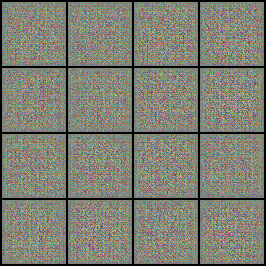

# DCGAN
This repository contains code for training a Deep Convolutional Generative Adversarial Network (DCGAN) using PyTorch. \
The implementation of the DCGAN was carried out with the primary objective of gaining a deeper understanding of GAN training. \
It was trained on the Pokemon dataset.

